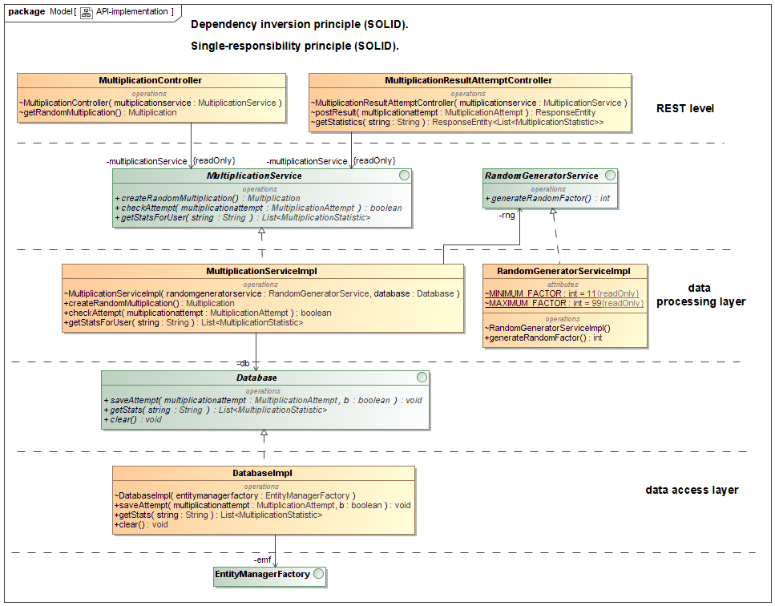

# General picture.

## How to compile.
1. With EclipseLink support: mvn clean package -Peclipselink.
2. With Hibernate support: mvn clean package -Phibernate.

## How to run.
Application can be found in "microservices.book.application" target directory. To run it type java -jar microservices.book.application-0.0.1-SNAPSHOT.jar.
