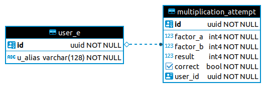
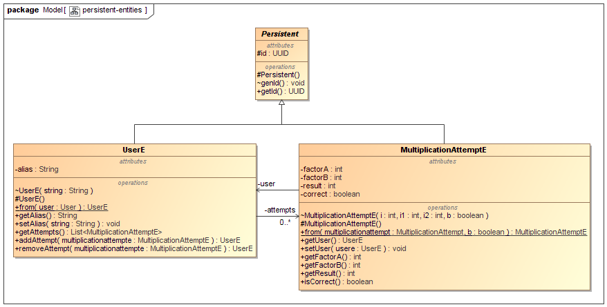

## Description.
The module implements persistent entities.

**database schema:**  
  
**persistent entities:**  
  
## Requirements
1. Should work with both EclipseLink and Hibernate.
2. Should work with both PostgreSQL jdbc and pgjdbc-ng.  

See more:

[https://thorben-janssen.com/dto-projections/](https://thorben-janssen.com/dto-projections/)

[https://thorben-janssen.com/dont-expose-entities-in-api/](https://thorben-janssen.com/dont-expose-entities-in-api/)

Please note that the module at compile time **only** depends on jakarta.persistence.